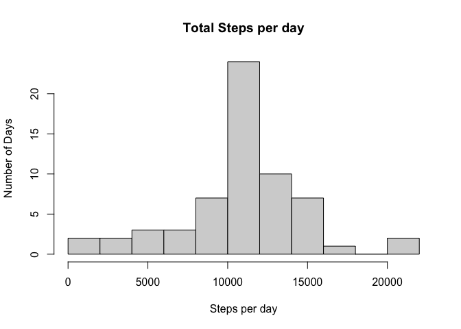

## Loading and preprocessing the data

First we need to download the data from [Activity monitoring data](https://d396qusza40orc.cloudfront.net/repdata%2Fdata%2Factivity.zip) [52K]. Then read the data in as numeric and Date classes.


```r
url<-"https://d396qusza40orc.cloudfront.net/repdata%2Fdata%2Factivity.zip"
download.file(url,"./fitbit.zip",method="curl")
unzip("fitbit.zip")
fbdata<-read.csv("activity.csv", colClasses=c("numeric","Date","numeric"),header = TRUE)
f <- function(x) sum(x, na.rm = TRUE)
tsday<-data.frame(as.numeric(tapply(fbdata$steps,factor(fbdata$date),f, simplify = FALSE)))
f <- function(x) mean(x, na.rm = TRUE)
Avsday<-data.frame(as.numeric(tapply(fbdata$steps,factor(fbdata$date),f, simplify = FALSE)))
dates<-as.Date(unique(fbdata$date))
summarydata<-data.frame(dates,tsday,Avsday)
colnames(summarydata)<- c("date", "Total Steps", "mean")
```

## What is mean total number of steps taken per day?

The exploratory histogram below shows the Frequency, in days, of total steps taken per day. So for more than 15 days the person's step count was over 10000.


```r
hist(summarydata$`Total Steps`, breaks=15, main="Total Steps per day", xlab ="Steps per day", ylab="Number of Days")
```

<!-- -->

To find the mean we must first find the number of days in the date range of data since the data is broken into 5 min segments and not days. Then take the sum of total number of steps taken divided by number of days but ignoring the NA values. Then find the median using the median function on the daily step data.


```r
stepsperday<-mean(summarydata$`Total Steps`,na.rm=TRUE)
Medstepsday<-median(summarydata$`Total Steps`,na.rm=TRUE)
paste("Mean Steps per Day"," ", stepsperday, "and"," ","Median Steps per Day", " ", Medstepsday)
```

```
## [1] "Mean Steps per Day   9354.22950819672 and   Median Steps per Day   10395"
```


## What is the average daily activity pattern?

The Plot below shows the average daily activity over the 60 days measured.


```r
plot(summarydata$date,summarydata$`Total Steps`, type="l", ylab = "Daily number of Steps", xlab="Days")
```

<!-- -->

To determine at what 5 min interval contains the maximum number of steps we determine the max for each day.  Then subset out the data using dplyr package:


```r
library(dplyr)
```

```
## 
## Attaching package: 'dplyr'
```

```
## The following objects are masked from 'package:stats':
## 
##     filter, lag
```

```
## The following objects are masked from 'package:base':
## 
##     intersect, setdiff, setequal, union
```

```r
days6<-fbdata %>% group_by(date)%>% filter(steps==max(steps))
intmax<-mean(days6$interval)
paste("On Average at interval ", intmax, "or about interval 1185")
```

```
## [1] "On Average at interval  1186.09090909091 or about interval 1185"
```


## Imputing missing values


```r
TNAs<-sum(is.na(fbdata$steps))
paste("Total number of NAs is: ", TNAs)
```

```
## [1] "Total number of NAs is:  2304"
```

To fill in the NA's we will use the mean of the daily 5 min iteration means.  


```r
intmean<-mean(summarydata$mean, na.rm=TRUE)
paste("The interval mean is for all 60 days is: ",intmean)
```

```
## [1] "The interval mean is for all 60 days is:  37.3825995807128"
```

We then replace the NAs with the interval mean:

```r
fbdata$steps[is.na(fbdata$steps)]<-intmean
```

The new data looks like this:


```r
tsday2<-data.frame(as.numeric(tapply(fbdata$steps,factor(fbdata$date),sum, simplify = FALSE)))
tsday2n<-tsday2$as.numeric.tapply.fbdata.steps..factor.fbdata.date...sum..simplify...FALSE..

hist(tsday2n, breaks=15, main="Total Steps per day", xlab ="Steps per day", ylab="Number of Days")
```

<!-- -->


Now we can calculate the mean and median again:


```r
stepsperday2<-mean(tsday2n)
Medstepsday2<-median(tsday2n)
paste("The new Mean Steps per Day"," ", stepsperday2, "and"," ","Median Steps per Day", " ", Medstepsday2)
```

```
## [1] "The new Mean Steps per Day   10766.1886792453 and   Median Steps per Day   10766.1886792453"
```

```r
paste("Compared to the old Mean Steps per Day"," ", stepsperday, "and"," ","Median Steps per Day", " ", Medstepsday)
```

```
## [1] "Compared to the old Mean Steps per Day   9354.22950819672 and   Median Steps per Day   10395"
```
By imputing data you can see that the data shifted closer to a standard deviation. The mean and median are now much closer together.

## Are there differences in activity patterns between weekdays and weekends?

First we must make a new factor variable in the data set that separates the weekdays from weekend.


```r
weekdays1 <- c('Monday', 'Tuesday', 'Wednesday', 'Thursday', 'Friday')
fbdata$weekday <- factor((weekdays(fbdata$date) %in% weekdays1), levels=c(FALSE, TRUE))
weekend1<-c('Saturday','Sunday')
fbdata$weekend <- factor((weekdays(fbdata$date) %in% weekend1), levels=c(FALSE, TRUE))
weekdaydata<-subset(fbdata,fbdata$weekday==TRUE)
weekendata<-subset(fbdata,fbdata$weekend==TRUE)
```


```r
par(mfrow = c(2, 1))
        plot(weekdaydata$date, weekdaydata$steps,type="l", ylab = "steps", xlab="Weekday")
        plot(weekendata$date, weekendata$steps,type="l", ylab="steps", xlab="Weekend")
```

<!-- -->


